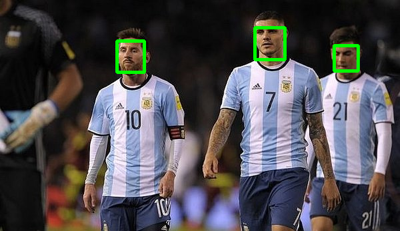
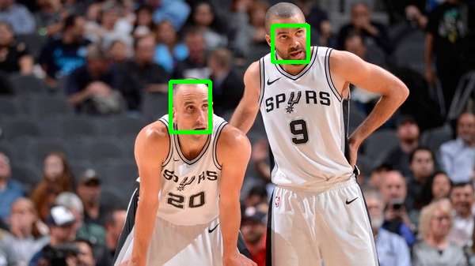
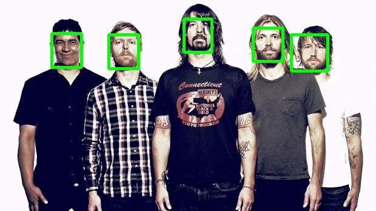
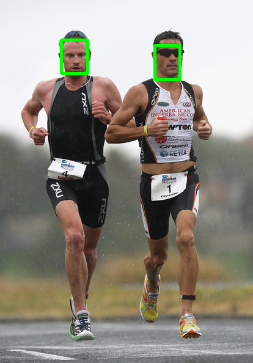
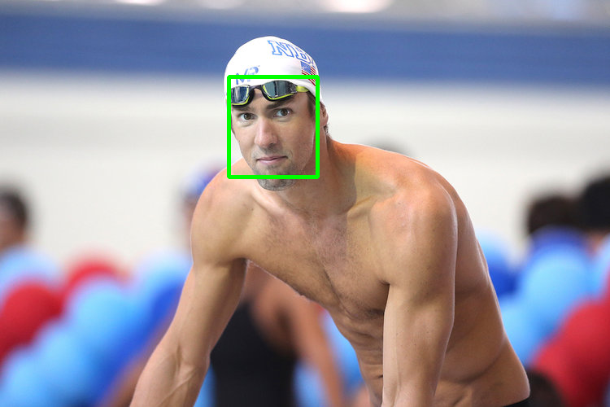
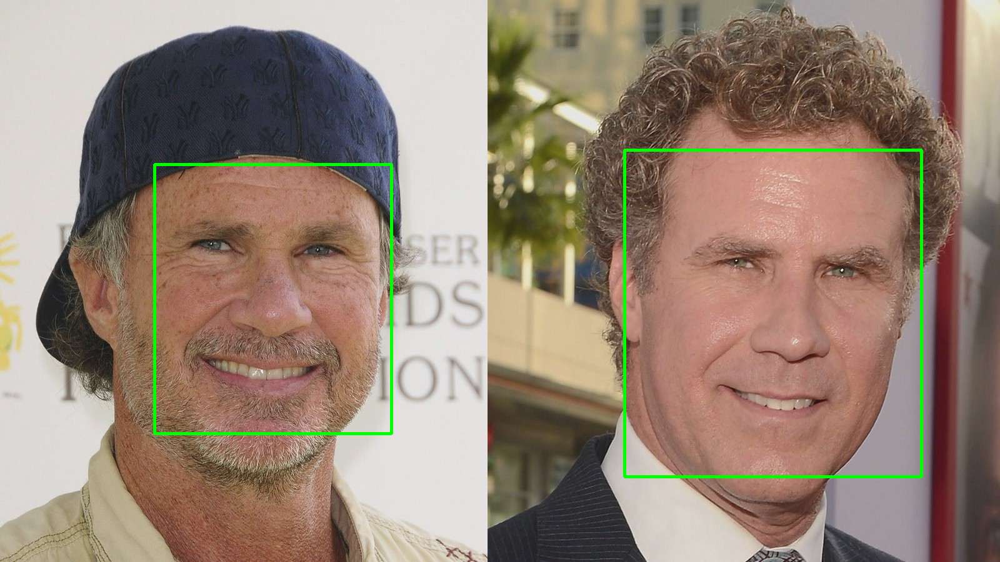
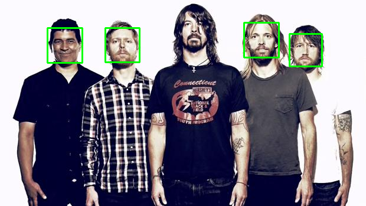
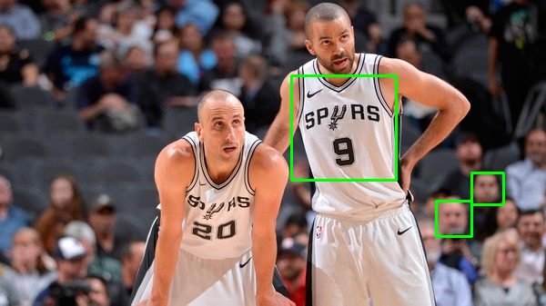
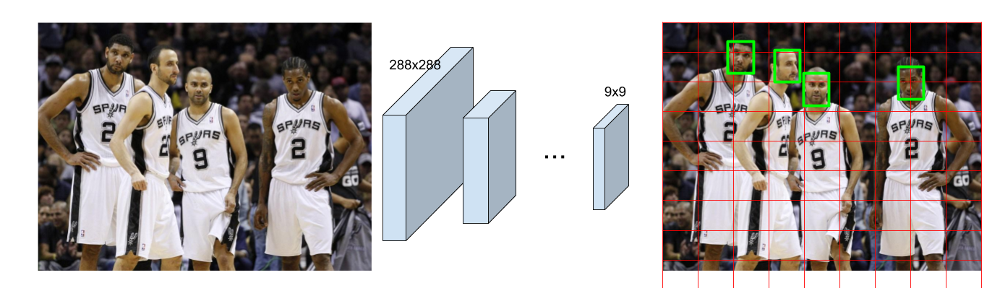
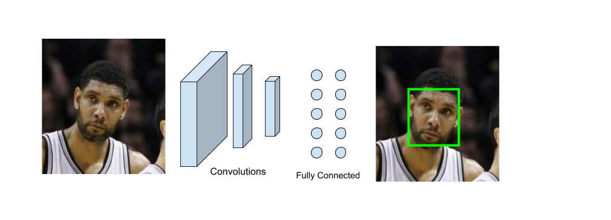

# *accessfaceid*

:dragon: CPU (Near) Real Time face detection alignment and verification. As part of exploring frontiers in state of art and possiblities in face recognition at RBS i have hacked together a small module brewing all the good things i could find.

<p align="center">
  
</p>
## Weights for the model
All weights for pretrained model of vggface (used in Release 1 and Release 2) and insightface respectively are 

[here](https://drive.google.com/file/d/19q0fe9sZPYJMfabUeFs1lRtgE8c16tQC/view?usp=sharing) 
[here](https://drive.google.com/file/d/1JYB8t2azk19xb3KLIT7kh_bRe0vsj1Z-/view?usp=sharing)
## How to run from source

```bash
$ git clone https://github.com/Anurag14/accessfaceid/
$ pip install -r requirements.txt
$ cd faced
$ python setup.py install
$ cd ../pretrained
$ cp <download destination of vggface weights> .
$ cd ..
$ python encode/encode.py
$ python livestream/newmain.py
```
## How to run a release
Download the release from [here](https://github.com/Anurag14/accessfaceid/releases/tag/beta) then 
```bash
$ pip install -r requirements.txt
$ cd faced
$ python setup.py install
$ cd ../training
$ mkdir weights
$ cd weights
$ cp <download destination of vggface weights> .
$ cd ../../
$ python encode.py
$ python main.py
```

> Soon to be available on `PyPI`.

## How to use face detection as an library

### As library

```python
import cv2

from faced import FaceDetector
from faced.utils import annotate_image

face_detector = FaceDetector()

img = cv2.imread(img_path)
rgb_img = cv2.cvtColor(img.copy(), cv2.COLOR_BGR2RGB)

# Receives RGB numpy image (HxWxC) and
# returns (x_center, y_center, width, height, prob) tuples. 
bboxes = face_detector.predict(rgb_img, thresh)

# Use this utils function to annotate the image.
ann_img = annotate_image(img, bboxes)

# Show the image
cv2.imshow('image',ann_img)
cv2.waitKey(0)
cv2.destroyAllWindows()
```

### As command-line program

```bash
# Detection on image saving the output
$ faced --input imgs/demo.png --save
```

or

```bash
# Live webcam detection
$ faced --input webcam
```

or

```bash
# Detection on video with low decision threshold
$ faced --input imgs/demo.mp4 --threshold 0.5
```

See `faced --help` for more information.

## Examples

<p float="left">
  
  
</p>
<p float="left">
  
  
</p>
<p float="left">
  
  
</p>

## Performance

CPU (i5 2015 MBP)          |  GPU (Nvidia TitanXP)
:-------------------------:|:-------------------------:
~5 FPS  | > 70 FPS

## Comparison with Haar Cascades

Haar Cascades are one of the most used face detections models. Here's a comparison with OpenCV's implementation showing *faced* robustness.

*faced*             |  Haar Cascade
:-------------------------:|:-------------------------:
  |  
  |  
  |  

## About *face detection* method

*faced* is an ensemble of 2 deep neural networks (implemented using **tensorflow**) designed to run at Real Time speed in CPUs.

#### Stage 1:

A custom fully convolutional neural network (FCNN) implementation based on [YOLO](https://pjreddie.com/darknet/yolo/). Takes a 288x288 RGB image and outputs a 9x9 grid where each cell can predict bounding boxes and probability of one face.

<p align="center">
  
</p>


#### Stage 2:

A custom standard CNN (Convolutions + Fully Connected layers) is used to take a face-containing rectangle and predict the face bounding box. This is a fine-tunning step. (outputs of Stage 1 model is not so accurate by itself, this is a *corrector* step that takes the each bouding box predicted from the previous step to improve bounding box quality.)

<p align="center">
  
</p>


### Why not just perform transfer learning on trained YOLO (or MobileNet+SSD) ?

Those models were designed to support multiclass detection (~80 classes). Because of this, these networks have to be powerfull enough to capture many different low and high level features that allow them to understand the patterns of very different classes. Powerful in this context means large amount of learnable parameters and hence big networks. These big networks cannot achieve real time performance on CPUs. [1]

This is an overkill for the simple task of just detecting faces. This work is a proof of concept that lighter networks can be designed to perform simpler tasks that do not require relatively large number of features.

[1] Those models cannot perform Real Time on CPU (YOLO at least). Even tiny-yolo version cannot achieve 1 fps on CPU (tested on 2015 Lenovo Yoga 500 with 2.6 GHz Intel Core i7).

### How was it trained?

Training was done with [WIDER FACE](http://mmlab.ie.cuhk.edu.hk/projects/WIDERFace/) dataset on Nvidia Titan XP GPU.

> If you are interested in the training process and/or data preprocessing, just raise an `issue` and we'll discuss it there.

### How to run on GPU?

Just install `tensorflow-gpu` instead of `tensorflow`.

### Status

🚧 Work in progress 🚧
Models will be improved and uploaded.

**This is not a Production ready system. Use it at your own risk.**

